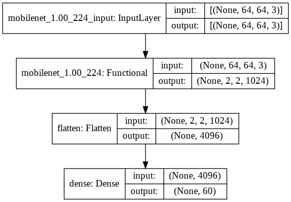

# **Bangla Handwritten Character Recognizer**

This is a web app that can recognize bangla handwritten characters. Recognition task is done by using a fine tuned convolutional neural network model.

<a href="https://bangla-character-recognizer.herokuapp.com/"> Click here to see live demo </a> <br>
This web app may take upto a minute to load. Pease waite a little bit.

<br>

# **Table of Contents**

-   [Technologies](#Technologies)
-   [Screen Capture](#Screen-Capture)
-   [Model Architecture](#Model-Architecture)
-   [How to run this app](#How-to-run-this-app)
-   [Dataset Source](#Dataset-Source)

<br>

# **Technologies**

-   Tensorflow 2.3
-   Keras 2.4
-   Python 3.7
-   HTML 5
-   CSS 3
-   Javascript
-   Flask

<br>

# **Screen Capture**


<br>

# **Model Architecture**



<br>

# **How to run this app**

-   Create a project directory in your local machine
-   cd to the project directory
-   Run the command in your shell to clone the repo or simply download the zip file

```
$ git clone https://github.com/SaihanTaki/Bangla-Character-Recognition.git
$ cd Bangla-Character-Recognition
```

-   Create a virtual environment
-   Activate the virtual environment
-   Run these command in your shell

```
$ pip install -r requirements.txt
$ flask run
```

<br>

# **Dataset Source**

<a href="https://shahariarrabby.github.io/ekush/#home"> Ekush Dataset </a>
